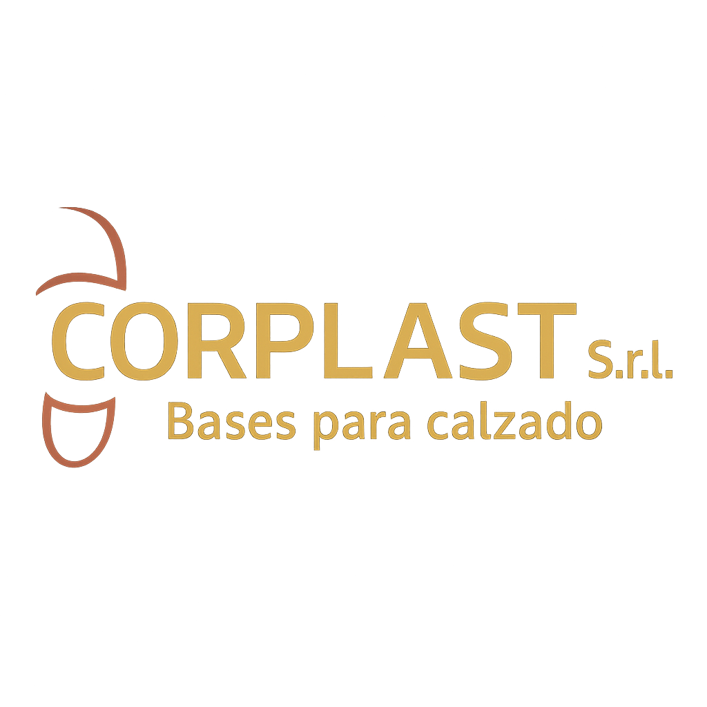
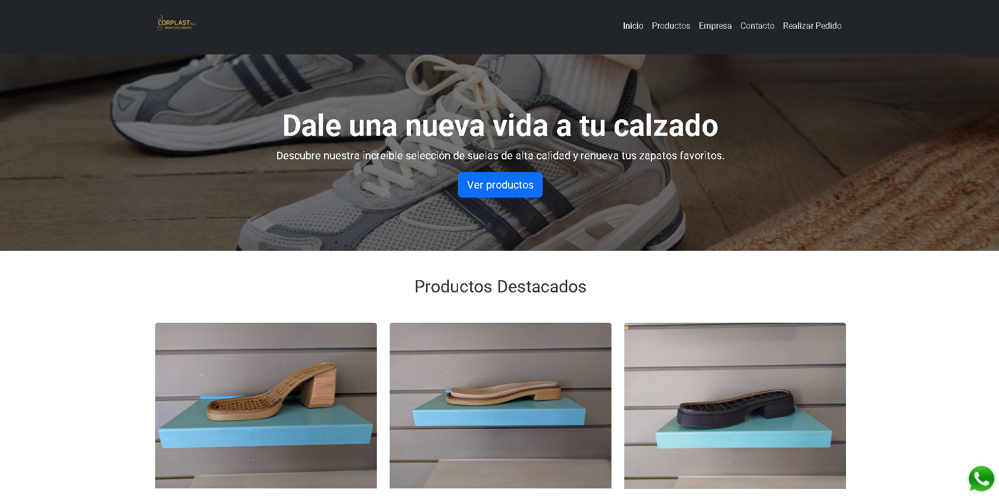

  

  Sitio web institucional para <b>Corplast S.R.L.</b> 
  Empresa dedicada a la fabricación y venta de <b>suelas y bases para calzado</b> en Argentina.

  
  
  
  

---

## 🏢 Descripción

Este proyecto fue desarrollado como parte de mi experiencia laboral en **Corplast S.R.L.**, una empresa dedicada a la producción de bases para calzado.  
El sitio web fue diseñado para reflejar la identidad de la marca, presentar los productos y facilitar el contacto con clientes minoristas y mayoristas.

Incluye una **estructura moderna y adaptable (responsive)** con navegación clara y estética profesional.

---

## ✨ Secciones principales

- 🏠 **Inicio:** presentación e introducción visual de la marca.  
- 🧱 **Productos:** catálogo con artículos destacados, descripciones y materiales.  
- 🏭 **Empresa:** historia, valores y compromiso con la calidad.  
- 📞 **Contacto:** formulario y datos de contacto directo.  
- 📦 **Realizar Pedido:** acceso rápido para consultas o encargos.

---

## 🧰 Tecnologías utilizadas

- **Frontend:**
  - HTML5 + CSS3
  - Bootstrap 5.3
  - Font Awesome (iconografía)
  - Google Fonts (tipografía Roboto)
- **Recursos:**
  - Imágenes optimizadas y favicon personalizado
- **Diseño:**
  - Layout responsive con `container`, `row`, `col` y `card`
  - Colores y estilo corporativo basados en la identidad visual de Corplast

---

## 🚀 Ejecución local

https://corplast.vercel.app/

---

## 🖼️ Vista previa

  
  

---

## 📄 Licencia

Este proyecto fue desarrollado por **Agustín Pujol** como trabajo de desarrollo web para **Corplast S.R.L.**  
Uso con fines educativos o de portafolio personal permitido.  
© 2025 Agustín Pujol. Todos los derechos reservados.

---

## 👨‍💻 Autor

**Agustín Pujol**  
Desarrollador de software | Android · Web · UX/UI  
· [LinkedIn]([https://www.linkedin.com/in/agustinpujol12](https://www.linkedin.com/in/agustinpujol/))
